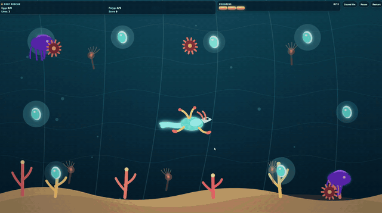

# Coral Dragon Reef Rescue

A self-contained browser game about guiding a luminous coral dragon through an underwater reef. Collect **8 glowing reef eggs** and heal **5 damaged coral polyps** before the dragon loses all 3 vitality segments. Purple wardens and drifting sea hazards make the rescue progressively harder.

**Play it:** <https://gbgh1.github.io/coral-dragon-reef-rescue/> · [Hugging Face Space](https://huggingface.co/spaces/gbuzhf/coral-dragon-reef-rescue)

[](https://gbgh1.github.io/coral-dragon-reef-rescue/)

## How it was made

Generated in a **single shot** by [`Nex-N2.5-mini-OrcaRouter-Sangreal-23G-ICE.gguf`](https://huggingface.co/gbuzhf/Nex-N2.5-mini-OrcaRouter-Sangreal-ICE/blob/main/Nex-N2.5-mini-OrcaRouter-Sangreal-23G-ICE.gguf), running locally through the Nous Hermes desktop harness on Windows 11:

- **GPU:** RTX 3070, 8 GB VRAM
- **RAM:** 32 GB
- **MTP:** off
- **Time:** about 45 minutes

## Objective

- Collect every egg: **Eggs 8/8**.
- Heal every damaged polyp: **Polyps 5/5**.
- Avoid wardens and hazards while moving through the reef.
- Win only when both objectives are complete.
- Lose when lives reach 0.

A run is designed to take roughly 3–5 minutes. The first part is an opening, then wardens and hazards enter at intervals and become faster as the rescue progresses.

## Controls

### Keyboard

- **Arrow Keys** or **WASD**: move the dragon.
- **P** or **Esc**: pause/resume.
- The game also pauses automatically when the tab loses visibility.

### Pointer and touch

- The four on-screen arrows appear on touch devices and narrow viewports.
- Press or drag across an arrow to move.
- Buttons remain usable with a pointer; use **Pause**, **Restart**, and **Sound On/Off** in the HUD.

## Win and loss rules

- **Win:** Eggs is exactly `8/8` **and** Polyps is exactly `5/5`.
- **Loss:** Lives reaches `0`; the loss overlay reports the exact final Eggs and Polyps counters.
- A collision immediately reduces the numeric lives counter and extinguishes exactly one of the three vitality segments, then gives the player brief invulnerability.

## Architecture

`index.html` is intentionally one file with no imports, external fonts, images, audio, CDNs, or network requests.

- **State:** logical game dimensions, totals, counters, player, entities, particles, timers, input, and audio state.
- **World setup:** deterministic egg and polyp positions; wardens and hazards start in bounds and are added during the run.
- **Update:** delta-time movement, spawning, egg collection, sustained polyp healing, collision, particles, and HUD synchronization.
- **Render:** layered reef, coral, bubbles, eggs, polyps, wardens, hazards, dragon, particles, and HUD overlays.
- **Input:** keyboard, pointer/touch buttons, pause/resume, visibility handling, and resize clamping.
- **Audio:** Web Audio oscillators initialized only after a user interaction; sound can be muted from the HUD.
- **Reset:** one `resetGame()` path is shared by Start Rescue, Try Again, Play Again, HUD Restart, and pause Restart. It rebuilds all entities, particles, counters, timers, input, audio state, overlays, and the single animation loop. The HUD Restart control remains available in every state.

The game uses a fixed `960x540` logical canvas and CSS scales it to a responsive 16:9 stage. Gameplay coordinates are clamped after resize.

## Local launch

No installation or build step is required.

1. Save this folder as `Coral Dragon Reef Rescue`.
2. Open `index.html` directly in a modern browser.
3. If your browser blocks local files, serve the folder instead:

   ```bash
   python -m http.server 8000
   ```

4. Open <http://localhost:8000> in a browser.

The game has no network calls, so opening the local file directly is supported.

## Validation notes

The implementation was checked with JavaScript parsing and local browser/server validation. The browser audit is observed evidence only for the rendered page and interaction paths; full screen-reader and WCAG conformance still require a manual assistive-technology pass.
